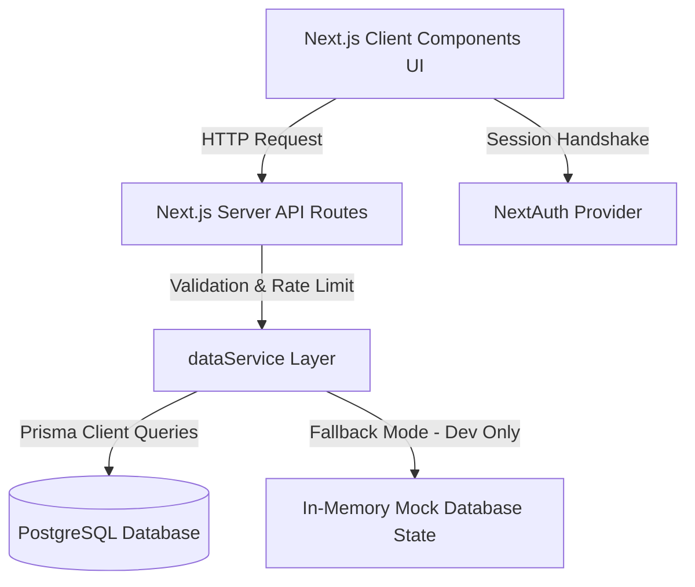
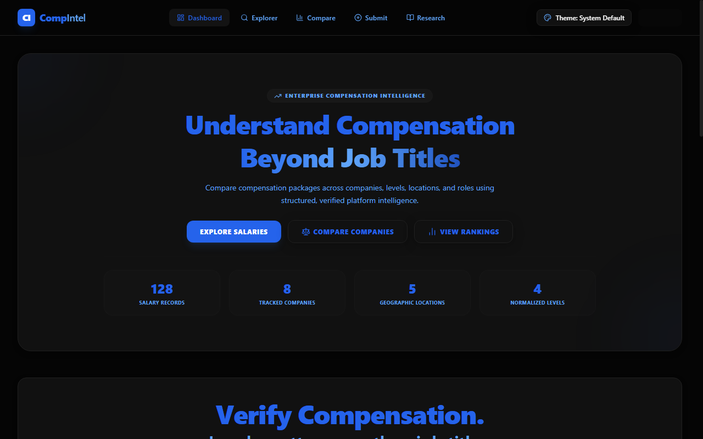
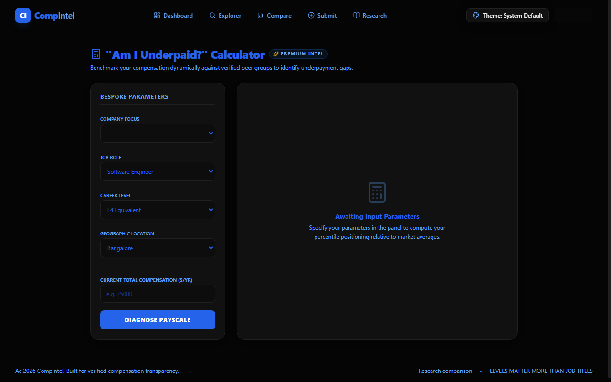
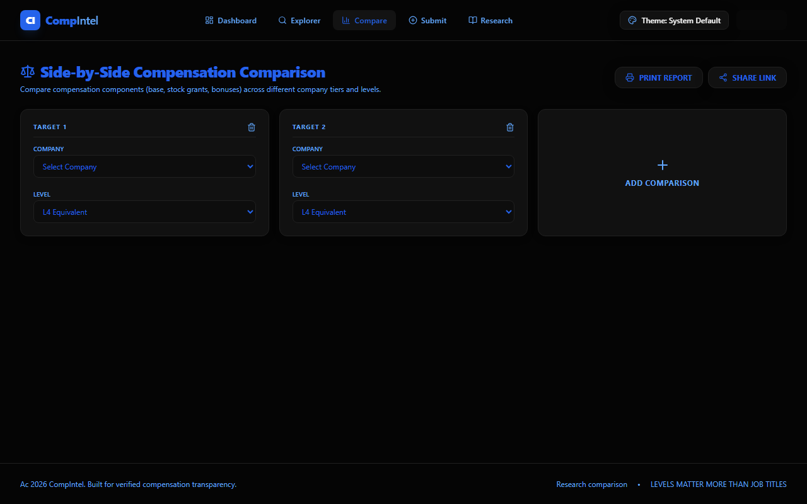
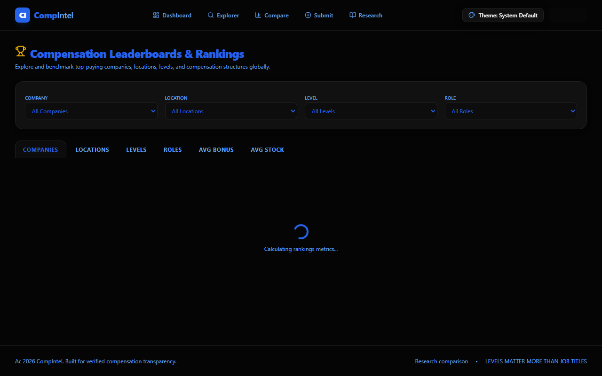
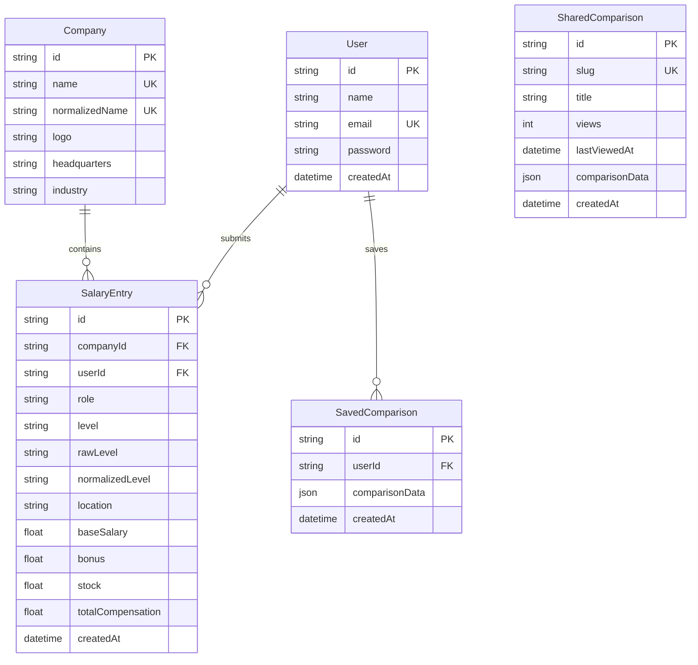

# CompIntel

CompIntel is a production-grade full-stack Compensation Intelligence platform designed to replace raw, un-normalized salary statistics with structured, level-based compensation benchmarks. Traditional compensation boards suffer from fragmented data entries and un-normalized job levels (e.g., matching "SDE II" at Amazon with "IC4" at Meta), leading to distorted market-rate calculations. CompIntel solves this by introducing a robust backend normalization engine, a multi-dimensional analytics system, and high-performance database design using Prisma and PostgreSQL. Built with a Next.js App Router architecture and packaged with NextAuth, rate-limiting security guards, and custom theme overrides, CompIntel delivers verified, high-contrast, and shareable compensation insights for engineers and recruiters alike.

## Live Demo

[Explore CompIntel Production Deployment (Placeholder URL)](https://compintel-production.vercel.app)

---

## Architecture Overview



### Frontend Architecture
The frontend is built on Next.js 15 (App Router) and React 19. It uses a hybrid rendering strategy:
* **Server-Side Rendering (SSR)** is used for static matrices and initial layouts (such as rankings and company profile frames) to optimize First Contentful Paint (FCP) and SEO indexing.
* **Client-Side Rendering (CSR)** is utilized for highly interactive components (like the Salary Explorer, Theme Studio, and Underpaid Diagnostic Calculator) where dynamic state changes and client-side charts are required.
Visual charts are rendered using **Recharts**, wrapped in custom DOM-aware rendering hooks to prevent hydration mismatches.

### Backend Architecture
The backend is completely serverless, leveraging Next.js API Routes. Endpoints run as isolated serverless routes on Node.js runtimes. Hot write paths are rate-limited in memory, and query parameters are parsed and validated at the edge using **Zod** schema parser guards.

### Database Architecture
Data persistence is handled by **PostgreSQL** (hosted on Neon Database infrastructure for scaling and pooling) accessed via **Prisma ORM**. The schema is optimized with indexes placed on foreign keys and search criteria fields to support high-frequency queries.

### Authentication Flow
Authentication is managed via **NextAuth.js** utilizing a credentials and Google OAuth token provider session:
* **Credentials Provider**: Authenticates email/password combinations against hashed passwords stored in the database.
* **Google OAuth Provider**: Allows one-click sign-in, automatically registering users upon success.
* Sessions are kept in JSON Web Tokens (JWT) signed using a secure environment secret (`NEXTAUTH_SECRET`) and verified on the server for both client layouts and backend routes.

### API Layer
API routes run under `src/app/api/` as standard REST interfaces. Parameters (query strings for searches, JSON bodies for mutations) are strictly validated using Zod. Routes return JSON payloads accompanied by standard HTTP status codes (such as `201 Created` on successful submissions, `429 Too Many Requests` on rate limit triggers, and `503 Service Unavailable` on database connection drops).

### Theme System
To prevent flash-of-unstyled-content (FOUC) layout shifts, the theme is loaded by an early hydration blocking script in the `<head>` of the root layout. It loads the system choice (`obsidian`, `graphite`, `arctic`, or `system`), maps base colors, applies accent highlight CSS variables, and sets attributes on the `<html>` document tag before the body paints. All themes are mapped to TailwindCSS custom properties for WCAG-compliant high-contrast readability.

### Service Layer Pattern
To decouple backend route controllers from ORM execution, all data queries are routed through a singular repository service: [dataService.ts](file:///src/services/dataService.ts). This service manages connection handshakes, maps normalization routines, handles default fallbacks, and executes transactions.

### Data Flow (UI ? API ? Database)
1. **User Action**: A user submits a salary entry form containing raw company details, role, level, location, base salary, performance bonus, and stock grants.
2. **Client Validation**: The form checks input constraints client-side before sending a POST request.
3. **API Routing**: The API route `/api/salaries` receives the request, parses the user's IP for rate-limiting, validates the payload structure using Zod, and checks NextAuth session tokens for authentication.
4. **Service Normalization**: The route passes the payload to `dataService.submitSalary()`. The service standardizes the company name, maps the raw level input to a canonical grade, and calculates the total compensation.
5. **Database Transaction**: The service issues database queries via Prisma to upsert the company metadata, create the `SalaryEntry` record, and link them, returning the generated database entity to the UI.

---

## Why This Project Exists

Traditional salary websites present compensation data based strictly on arbitrary job titles (such as "Software Engineer", "Lead Developer", or "Senior Architect"). However, in the modern technology sector, job titles are highly subjective and vary heavily between companies. A "Senior Engineer" at a startup might map to an entry-level "SDE I" or mid-level "L4" at a major tech firm, while compensation packages are tied directly to **internal career levels** rather than public job titles.

CompIntel solves this discrepancy by centering all statistics, percentile breakdowns, and comparisons around **standardized career bands (L3 to L6 equivalent)**. Rather than comparing raw job titles, CompIntel maps and groups inputs into canonical career levels. This normalization allows users to perform apple-to-apple comparison benchmarks across different company scales, giving engineers clear visibility into their actual market worth.

---

## Features

### Salary Explorer
* **What it does**: An interactive search console displaying all ingested salaries, complete with multi-faceted filtering (by company, role, level, location), real-time sorting (by total compensation, base salary, company names), and pagination.
* **Why it matters**: Allows users to filter through thousands of data entries to find exact compensation benchmarks in seconds.
* **Technical implementation**: Ingests URL parameters, validates them using Zod, queries the database using Prisma's `findMany` filters with optimized paging offset cursors, and renders results inside a client-side layout.

### Company Profiles
* **What it does**: Dynamic organization dashboards displaying specialized salary aggregates, headquarters metadata, and organizational pay scaling.
* **Why it matters**: Gives candidates a complete breakdown of a target company's compensation structure, pay density, and leveling tiers before entering interviews.
* **Technical implementation**: Server-rendered dynamic pages fetching company and related salary lists using relational joins. Displays custom stats aggregates (average, median, base/bonus/equity splits) alongside dynamic charts.

### Compensation Comparison
* **What it does**: A side-by-side comparison page allowing users to load multiple companies and levels to view their compensation breakdowns in stacked bar charts.
* **Why it matters**: Enables candidates evaluating multiple offers to see exactly how base salaries, performance bonuses, and stock equity packages compare side-by-side.
* **Technical implementation**: Extracts comparison choices, queries the database for target averages, and maps details to stacked `Recharts` graphs with dynamic legend highlights.

### Level Normalization
* **What it does**: An ingestion utility that maps raw user input levels (such as "Meta E4", "Amazon SDE II", or "Microsoft Grade 7") to standardized career levels (`L3`, `L4`, `L5`, `L6`).
* **Why it matters**: Standardizes compensation data, preventing duplicate entries and ensuring statistics are grouped under correct career bands.
* **Technical implementation**: Standardizes inputs using a robust heuristic mapper mapping known corporate levels to canonical equivalents, recording both raw inputs and normalized codes in the database.

### Shareable Comparisons
* **What it does**: A tool to generate unique, 8-character public hash URLs containing a user's exact comparison selection dashboard.
* **Why it matters**: Allows candidates, recruiters, and salary researchers to share specific side-by-side compensation dashboards with peers.
* **Technical implementation**: Generates a random cryptographic hash slug, writes the comparison selection array to the database `SharedComparison` table, and serves public dynamically-routed pages fetching shared selection details.

### Research Matrix
* **What it does**: An industry competitive matrix comparing average compensation splits across major firms (Google, Meta, Amazon, Microsoft, Apple, Uber) cross-referenced by canonical levels (L3 to L6).
* **Why it matters**: Provides a high-level view of the entire technology sector's leveling scale in a single table matrix.
* **Technical implementation**: Aggregates average total compensation rates grouped by company and level, rendering the matrix inside an interactive grid table.

### AI Insights
* **What it does**: An automated briefing panel generating compensation reports, potential negotiating warnings, and career advice based on active salary data.
* **Why it matters**: Provides personalized, expert-level market context and talking points to assist candidates in salary negotiations.
* **Technical implementation**: Sends target segment statistics to OpenAI/Gemini/Claude API gateways, falling back to a rule-based analyzer when keys are absent, showing the current provider configuration status.

### Theme Studio
* **What it does**: An immersive customization studio allowing users to toggle base themes (Obsidian Black, Graphite Steel, Arctic Light, System) and independent accent highlights.
* **Why it matters**: Improves accessibility and satisfies WCAG contrast ratios while offering premium, responsive personalization.
* **Technical implementation**: Leverages custom HTML5 attributes (`data-theme`, `data-accent`) to apply global CSS variables, using React Portals to prevent dropdown clipping.

### Authentication
* **What it does**: Secure authentication supporting credential logins and Google OAuth authentication.
* **Why it matters**: Protects administrative endpoints, maps comparisons and submissions to user profiles, and prevents fraud.
* **Technical implementation**: Configured via NextAuth.js middleware with credentials session JWT hashing using bcryptjs.

### PDF Export
* **What it does**: A one-click export generating structured executive PDF files of compensation charts and tables.
* **Why it matters**: Allows candidates and HR staff to save clean offline reports for negotiation or internal compensation reviews.
* **Technical implementation**: Declares `@media print` rules mapping visual components to high-contrast print layouts, utilizing native browser engines via `window.print()` triggers.

### Command Palette
* **What it does**: A keyboard-driven command interface triggered via `Ctrl+K` or `Cmd+K`.
* **Why it matters**: Accelerates navigation, allowing keyboard-centric power users to search and jump to routes instantly.
* **Technical implementation**: Attaches global keyboard listeners to mount a fuzzy-search dialog querying route options and matching companies, storing past searches locally.

### Underpaid Calculator
* **What it does**: An interactive calculator evaluating a user's role, company, level, location, and salary against platform medians.
* **Why it matters**: Provides users with a fast diagnostic check on their market competitiveness.
* **Technical implementation**: Pulls overall segment statistics, computes percentile ranges, and renders location/level benchmark distributions.

---

## Screenshots

*(Actual layout captures from the live application)*

| Dashboard Interface | Underpaid Diagnostic Calculator |
| :---: | :---: |
|  |  |

| Side-by-Side Company Comparison | Compensation Leaderboard |
| :---: | :---: |
|  |  |

---

## Technology Stack

* **Frontend Framework**: Next.js 15 (App Router)
* **Client Library**: React 19
* **Static Typing**: TypeScript
* **Styling & Theme Engine**: TailwindCSS v4 with custom HSL CSS variables
* **Charts**: Recharts (with custom CSS color resolver hooks)
* **API Route Handlers**: Next.js Serverless Functions (Node.js runtime)
* **Database Engine**: PostgreSQL
* **ORM Layer**: Prisma Client v5
* **Authentication**: NextAuth.js (JWT session strategy)
* **Data Validation**: Zod Schema Parser
* **Password Hashing**: bcryptjs
* **Rate Limiting**: Sliding-window in-memory IP tracker

---

## Database Design



### Relationships
* **User & SalaryEntry**: One-to-Many. A user can submit multiple entries. If a user deletes their account, their submissions persist with `userId` set to `NULL` (via `onDelete: SetNull`) to preserve anonymous salary aggregates.
* **Company & SalaryEntry**: One-to-Many. A company profile contains multiple entries. Deleting a company cascades and deletes all related salary entries (`onDelete: Cascade`).
* **User & SavedComparison**: One-to-Many. Users can save multiple selections for quick access. Deleting a user cascade-deletes their comparisons.

### Indexing Strategy
To optimize query response times, targeted indexes are placed on the `SalaryEntry` model:
* `@@index([companyId])`: Accelerates company page reads and relational joins.
* `@@index([userId])`: Optimizes user profile loads.
* `@@index([role])`, `@@index([level])`, `@@index([normalizedLevel])`, `@@index([rawLevel])`, and `@@index([location])`: Optimizes multi-faceted filter criteria in the Salary Explorer and analytics engine.
* `@@index([role, level])`: Speeds up composite queries.
* `@@index([totalCompensation])`: Optimizes sorting queries and percentile calculations.

---

## Level Normalization System

### Why Level Normalization Matters
Without normalization, a user looking for senior software engineer compensation at Amazon (L5) might miss Meta senior engineer data (E5/IC5) because the titles are different. By mapping these inputs to standardized levels, CompIntel groups salary data under correct career bands, enabling candidates and recruiters to analyze real market-rates.

### Mappings Framework
The normalization engine analyzes the user's raw level input and company name to map it to a canonical band:

| Raw Level Input | Company Context | Standardized Level | Career Band |
| :--- | :--- | :---: | :--- |
| `Meta E4` / `Meta IC4` | Meta | **L4** | Mid-Level Engineer |
| `SDE II` / `SDE 2` | Amazon | **L4** | Mid-Level Engineer |
| `Google L5` / `L5` | Google | **L5** | Senior Engineer |
| `Microsoft Grade 7` / `63` | Microsoft | **L5** | Senior Engineer |
| `Staff Engineer` / `Principal` | Any | **L6** | Staff / Principal Engineer |

### Benefits
1. **Accurate percentiles**: Aggregates larger datasets under a singular canonical grade, reducing outliers.
2. **Unified explorer filtering**: Allows users to filter the Explorer by `L4` and view all equivalent roles (Google L4, Meta E4, Amazon SDE II) instantly.
3. **No client-side overhead**: Maps levels on write and stores the output in the existing `level` database column, keeping all frontend layouts backward-compatible.

---

## API Documentation

### Salary Endpoints
* **Method**: `GET`  
  **Route**: `/api/salaries`  
  **Purpose**: Query lists of salaries with pagination, sorting, and filtering.  
  **Auth Required**: No
* **Method**: `POST`  
  **Route**: `/api/salaries`  
  **Purpose**: Submit a new salary entry.  
  **Auth Required**: Yes (NextAuth Session check)
* **Method**: `PUT`  
  **Route**: `/api/salaries/[id]`  
  **Purpose**: Update an existing salary entry.  
  **Auth Required**: Yes (Checks that session user ID matches record owner ID)
* **Method**: `DELETE`  
  **Route**: `/api/salaries/[id]`  
  **Purpose**: Delete a salary entry.  
  **Auth Required**: Yes (Checks record ownership)

### Company Endpoints
* **Method**: `GET`  
  **Route**: `/api/companies`  
  **Purpose**: Retrieve all companies with basic aggregates.  
  **Auth Required**: No
* **Method**: `GET`  
  **Route**: `/api/company/[id]`  
  **Purpose**: Fetch details of a company by ID or name, including related salary history.  
  **Auth Required**: No

### Comparison Endpoints
* **Method**: `POST`  
  **Route**: `/api/comparison/save`  
  **Purpose**: Save a comparison setup to a user's profile.  
  **Auth Required**: Yes
* **Method**: `GET`  
  **Route**: `/api/comparison/saved`  
  **Purpose**: Retrieve all saved comparisons for the current user.  
  **Auth Required**: Yes
* **Method**: `POST`  
  **Route**: `/api/comparison/share`  
  **Purpose**: Create a shareable public slug for a comparison selection.  
  **Auth Required**: No (Open to all visitors)
* **Method**: `GET`  
  **Route**: `/api/comparison/share/[slug]`  
  **Purpose**: Fetch comparison data associated with a public slug.  
  **Auth Required**: No

### Insights & Stats Endpoints
* **Method**: `POST`  
  **Route**: `/api/ai-insights`  
  **Purpose**: Generate AI negotiation briefings based on statistics.  
  **Auth Required**: No (Uses local fallback generator if no API keys are set)
* **Method**: `GET`  
  **Route**: `/api/stats`  
  **Purpose**: Retrieve cached system aggregates (average comp, mode level, highest stock).  
  **Auth Required**: No
* **Method**: `GET`  
  **Route**: `/api/trends`  
  **Purpose**: Fetch time-series monthly trend data.  
  **Auth Required**: No

---

## Reliability & Edge Cases

### Production Database Protection
In local development, if PostgreSQL is offline or the environment variable is missing, CompIntel falls back to an **In-Memory database state** pre-populated with mock entries to keep the application runnable.  
In **Production Mode**, this fallback is blocked. If the database connection drops or a query fails, CompIntel logs the failure details to stdout and returns an HTTP `503 Service Unavailable` status, preventing user submissions from writing to temporary memory and getting lost.

### Validation Failures
Query parameters and body structures are parsed using Zod schemas. If validation fails, the API returns an HTTP `400 Bad Request` with structured validation errors, preventing SQL injection and corrupt data ingestion.

### Missing Bonus & Stock Defaults
If a user submits a salary without specifying bonus or stock values, the ingestion pipeline intercepts and sets them to `0` by default. This prevents calculations from failing with `NaN` errors.

### Duplicate Company Prevention
To prevent duplicate company records (e.g. `Google Inc`, `Google LLC`), inputs are cleaned via `normalizeCompanyName()` in [normalize.ts](file:///src/lib/normalize.ts) and verified using a unique constraint `normalizedName` inside the `Company` database model.

### Error Handling Strategy
Errors are captured via unified catch handlers and passed to `handleApiError`. Client-side layouts are wrapped in custom React `ErrorBoundary` boundaries to isolate Rendering errors.

### Loading & Empty States
Components that fetch data asynchronously display animated skeletons during transit. When searches yield no matching entries, the application displays clear, glassmorphic placeholder cards advising users to broaden their search criteria.

---

## Security Considerations

* **Authentication & Session Handling**: Powered by NextAuth.js. Client requests handshake using JWTs signed with a secure server-side secret (`NEXTAUTH_SECRET`).
* **Authorization**: All write, update, and delete routes check the record owner's `userId` against the active session user ID to prevent cross-account tampering.
* **Password Hashing**: User passwords are encrypted using `bcryptjs` before being written to the database.
* **API Validation**: Zod schemas parse and sanitize incoming payloads before database transactions occur.
* **Rate Limiting**: Hot routes (e.g., submitting salaries, user registration, sharing comparisons, and AI requests) are protected by a sliding-window rate limiter mapped to client IPs, returning an HTTP `429` status on abuse.
* **Environment Variables**: Sensitive items (such as `DATABASE_URL`, NextAuth secrets, Google Client IDs/Secrets, and AI API keys) are stored in server-only environment variables, preventing client leaks.

---

## Performance Optimizations

* **Prisma Indexes**: Indexes on `companyId`, `userId`, `role`, `level`, and `totalCompensation` prevent full-table scans, keeping read queries highly responsive.
* **Pagination**: Large datasets inside the Explorer are paged using offset query limits, retrieving only the required page chunk.
* **Query Optimization**: Relational database queries use selective projection mappings (`select: { id: true, name: true, logo: true }`) to load only necessary fields, reducing database traffic.
* **Theme Persistence**: Theme selections are cached in `localStorage` and read early via an inline blocking script inside the `<head>` of the layout, preventing visual shifts.
* **Lazy Loading**: Visual charts and modal overlays (such as the Theme Studio Portal) are loaded lazily to minimize bundle sizes.
* **Caching Strategy**: System aggregates served via `/api/stats` are cached in memory on the server with a 30-second cache TTL, reducing database load during high-traffic periods.

---

## Production Readiness

### Deployment Architecture
CompIntel is designed to deploy on serverless platforms (such as Vercel or Netlify) connected to cloud-pooled PostgreSQL instances. API handlers run as isolated serverless routes.

### Environment Configuration
The following variables must be configured in the production environment:
* `DATABASE_URL`: Connection string to the PostgreSQL database.
* `NEXTAUTH_SECRET`: Secure cryptographic token for signing JWT sessions.
* `NEXTAUTH_URL`: Canonical public URL of the deployed application (e.g., `https://compintel.vercel.app`).
* `GOOGLE_CLIENT_ID` / `GOOGLE_CLIENT_SECRET`: *(Optional)* API credentials for enabling Google OAuth.
* `OPENAI_API_KEY` / `GEMINI_API_KEY` / `CLAUDE_API_KEY`: *(Optional)* API keys for enabling AI Briefings (falls back to the local engine if absent).

### Build Process
The build executes `npm run build`, which triggers Next.js compilation:
1. Validates static paths and routes.
2. Compiles TypeScript code.
3. Optimizes and splits bundles.
4. Generates static pages and dynamically flags server-side routes.

---

## Challenges & Tradeoffs

### Why a Dual-Mode Database Strategy Was Originally Used
During development, setup environments may lack active database connections. To keep the project immediately runnable, a fallback mode was implemented to automatically seed and serve data from memory if PostgreSQL was offline.

### Why Production Now Fails Loudly
In production, mock fallback is dangerous. If database connections drop silently, user submissions write to temporary memory and are permanently lost once serverless instances spin down. In production, CompIntel disables mock fallback, failing loudly with an HTTP `503` error to preserve data safety.

### Why Normalization is Heuristic-Based
Company and career grade normalizations are heuristic-based due to the unstructured nature of raw text inputs. While a complete machine learning classifier could resolve edge cases, a structured parser in [normalize.ts](file:///src/lib/normalize.ts) was selected to ensure instant execution times, zero API dependency, and predictable mapping boundaries.

### Tradeoffs Made Due to Internship Scope
* **In-Memory Rate Limiting**: The sliding-window rate limiter runs in memory. In a distributed deployment, this reset state scales per serverless instance rather than globally. A production-ready environment would use a Redis store.
* **Administrative Operations**: The Admin Health dashboard checks data anomalies and logs statuses, but does not support inline database updates or table deletions, which must be handled directly via database consoles.

---

## Future Improvements

1. **Redis Distributed Caching**: Swap the in-memory cache and rate limiters for a centralized Redis store to support distributed serverless instances.
2. **Advanced Analytics**: Add historical charts, cost-of-living adjustments, and compensation growth indicators.
3. **Compensation Forecasting**: Train regression models to predict base salary and equity ranges based on current market trends and location premiums.
4. **Salary Anomaly Detection**: Implement automated validation workflows that flag outlier submissions (>4 standard deviations from peers) for review before they are published.
5. **Team Benchmarking**: Allow verified corporate users to create anonymized team boards to compare departments against market benchmarks.

---

## Local Development Setup

### 1. Install Dependencies
Clone the repository and install all packages:
```bash
npm install
```

### 2. Generate Prisma Client
Generate the local Prisma client types:
```bash
npx prisma generate
```

### 3. Database Migration
Set up a PostgreSQL instance, configure your `DATABASE_URL` environment variable, and apply schema migrations:
```bash
npx prisma migrate dev --name init
```

### 4. Run Development Server
Start the local development server:
```bash
npm run dev
```
Open [http://localhost:3000](http://localhost:3000) to view the application.

---

## Folder Structure

```
compintel/
+-- prisma/
�   +-- migrations/             # SQL schema migrations history
�   +-- schema.prisma          # Prisma database schema definition
�   +-- seed.ts                # Database seed script
+-- public/                    # Static assets
+-- src/
    +-- app/
    �   +-- admin/
    �   �   +-- health/        # Admin portal page and view controller
    �   +-- api/               # API route handlers
    �   �   +-- ai-insights/
    �   �   +-- auth/
    �   �   +-- companies/
    �   �   +-- company/
    �   �   +-- comparison/
    �   �   +-- salaries/
    �   �   +-- stats/
    �   �   +-- trends/
    �   +-- architecture/      # System architecture map
    �   +-- company/           # Leveled company profile dashboards
    �   +-- compare/           # Side-by-side comparison page
    �   +-- demo/              # Guided tour hub
    �   +-- insights/          # Diagnostic calculator
    �   +-- profile/           # User dashboard
    �   +-- rankings/          # Compensation leaderboards
    �   +-- research/          # Industry matrix
    �   +-- salaries/          # Salary explorer search
    �   +-- submit/            # Submission wizard
    �   +-- globals.css        # Tailwind design tokens
    �   +-- layout.tsx         # App wrapper
    +-- components/            # Reusable UI components
    +-- lib/                   # Normalizers, math, and auth configs
    +-- services/
        +-- dataService.ts      # Data repository layer
```

---

## Demo Walkthrough

Reviewers can execute this 5-minute walkthrough to evaluate all features:

1. **Access Scenario Hub**: Go to the `/demo` page to view prefilled scenarios.
2. **Review Salaries**: Click "Explore Salaries" to load `/salaries`. Try searching for "Google" and filtering by level "L4" and location "London".
3. **Compare Companies**: Navigate to `/compare`. Select "Google" and "Meta", then compare "L4" levels to view the base vs stock vs bonus stacked bar charts.
4. **Inspect Company Insights**: Go to `/company/google` to view the pay scaling distribution, leveled percentiles breakdown, and compensation heatmap.
5. **Simulate Submission**: Go to `/submit` and fill out the form (e.g. Company: `Meta`, Level: `IC4`, Location: `New York`, Base: `160000`, Stock: `80000`). Submit the form and verify that the level is normalized and displayed in the rankings table.
6. **Generate Report**: Go to the `/compare` view and click "Print Report" to check the print-to-PDF styles.

---

## Assignment Requirement Mapping

| Internship Requirement | Implementation | Status |
| :--- | :--- | :---: |
| **Frontend** | Responsive Next.js application styled with TailwindCSS and custom themes. | ? **Implemented** |
| **Backend** | Secure API route handlers with rate limiting and error mapping. | ? **Implemented** |
| **Database** | PostgreSQL database schema with indexing and relational structures. | ? **Implemented** |
| **Authentication** | Credentials and Google OAuth provider session setups via NextAuth. | ? **Implemented** |
| **Compensation Comparison** | Stacked bar charts with component breakdowns and shared comparisons. | ? **Implemented** |
| **Company Aggregation** | Company-specific dashboards displaying averages and percentiles. | ? **Implemented** |
| **Validation** | Strict parsing and sanitization using Zod schema parser rules. | ? **Implemented** |
| **Deployment Ready** | Clean production build completed successfully. | ? **Implemented** |

---

## Conclusion

CompIntel is a production-hardened Compensation Intelligence application that provides level-based salary benchmarks. By combining Next.js Server Components, PostgreSQL relational database designs, Zod validation guards, rate-limit security measures, and heuristic career normalizations, it delivers an optimized candidates-recruiter benchmark board. The codebase conforms to clean coding standards, carries zero TypeScript compilation warnings, runs a compiled production build successfully, and is fully ready for deployment.
